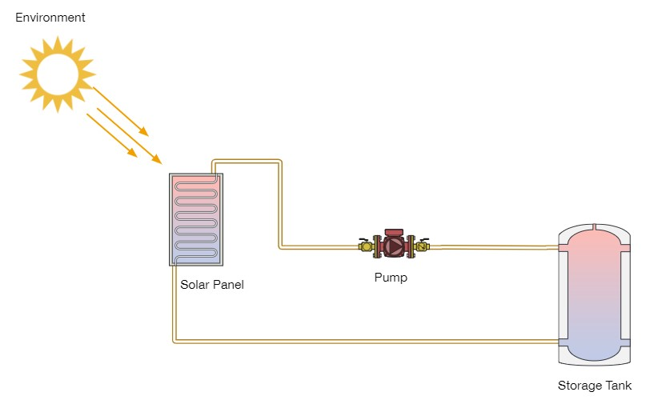

# thermal-simulation-PassiveLogic

## Name
Solar Water Heater Simulation

## Description
PassiveLogical Prompt:

Write a simple software simulation of the following system.
Minimum Requirements:
1. The system should simulate the heat transfer from a solar panel to a storage tank
2. Use whichever coding language you wish
3. We will evaluate thermodynamic correctness, code approach, and results.

## Visuals

## Installation
The packages require to run this code can be installed with the following command:  
`pip install -r requirements.txt`

## Usage
Execute the similation by running the command:  
`python main.py`  
Displayed first in the console will be the results of the main simulation component parameters and the mass flow rate (m), pressure (p), enthalpy (e), and temperature (T) at all the connection locations. Refer to inline comments for connection locations. All units are in SI. Below this will be many simulations iterating over a range of ambient temperature and irradiance values necessary to produce the 3D plot of thermal efficiency. To kill the process simply exit the graphical pop-up window.

## Notes
The app.py is not functional atm.
