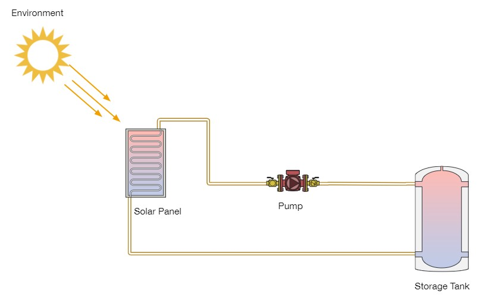

# Solar Water Heater Simulation

## Passive Logic Prompt:

Write a simple software simulation of the following system.
Minimum Requirements:
1. The system should simulate the heat transfer from a solar panel to a storage tank
2. Use whichever coding language you wish
3. We will evaluate thermodynamic correctness, code approach, and results.

## System Diagram

## Project Description
This repository contains three python files, `main.py`, `input.py`, and `components.py`.

### input.py
This file contains a single function called `get_weather_data()` which connects to the NREL's National Solar Radiation Database (NSRDB) API and pulls  weather data for the desired location and return a pandas dataframe.

### components.py
This file contains the model components of the system. All model components are defined as classes. The classes are:
- `Fluid`
- `Material`
- `Sun`
- `Container`
    - `Tank`
    - `SolarPanel`
    - `Pipe`
- `Pump`
All physics based heat transfer equations are implemented in the classes.

### main.py
This file contains the main simulation loop. It is responsible for intialize model components, calling `get_weather_data()` based on disired inputs, running the simulation, and producing a simple plot and csv of simulation results.

## Installation
#### Manual Installation
After cloning the repo, install the necessary packages to your enviorment by running command below:  

`pip install -r requirements.txt`

Execute the similation by running the command:  

`python main.py`  

Console output will prompt the user to execute the simulation in DEV mode or not(true/false). DEV mode will run `plt.show()` while `DEV == false` will save a png of the graph output and csv of simulation timeseries. Both modes print system variables each timestep to the terminal. 

To kill the DEV process simply exit the graphical pop-up window.

#### Docker Installation
After cloning the repo, build the docker image by running the command:  

`docker build -t solar-water-heater-simulation .`  

`docker run -it solar-water-heater-simulation`

## Simulation Assumptions

### Basic Assumptions
- The storage tank is a perfect cylinder.
- The panel is a rectangle of water. 
- The flow of a pump is modelled based on the transfer of energy through fluid mixing and
a flow rate.
- All pipe surface area is in the outdoor environment. 

### Thermodynamic Assumptions
- The tank is in thermal equalibrium with the indoor zone temperature at sim start.
- The panel and pipes are in thermal equalibrium with the outdoor zone temperature at sim start.
- 80% of energy from the sun is transferred into the panel.
- Mixing is assumed to be instantaneous, thus T_final is always reached after each timestep.
- The indoor temperature is constant dispate the tanks heat loss (there's a really good cooling system in there lol)
- Air has a constant convective heat transfer coefficient of 10 W/m^2K inside and 50 W/m^2K outside.
- Heat loss due to radiation is included in the heat transfer coefficent of air.
- All heat loss is 1D steady state heat transfer.

### Operational Assumptions
- The pump is sized such that it can overcome the system head and produce the constant flow defined.
- The speed of the pump is constant and instantaneous.
